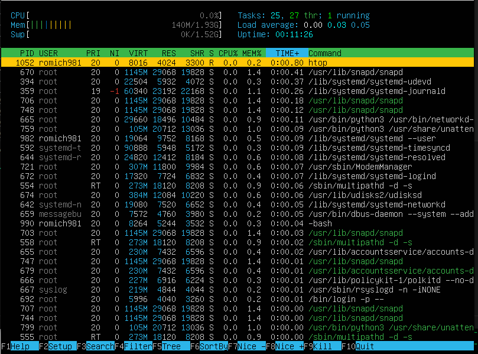

# Операционные системы UNIX/Linux (Базовый).

Установка и обновления системы Linux. Основы администрирования.

## Contents
1. [Предисловие](#Предисловие)
2. [Задания](#Задания) \
    2.1 [Установка ОС](#part-1-установка-ос)  
    2.2 [Создание пользователя](#part-2-создание-пользователя)  
    2.3 [Настройка сети ОС](#part-3-настройка-сети-ос)   
    2.4 [Обновление ОС](#part-4-обновление-ос)  
    2.5 [Использование команды  sudo](#part-5-использование-команды-sudo)  
    2.6 [Установка и настройка службы времени](#part-6-установка-и-настройка-службы-времени)  
    2.7 [Установка и использование текстовых редакторов](#part-7-установка-и-использование-текстовых-редакторов)  
    2.8 [Установка и базовая настройка сервиса SSHD](#part-8-установка-и-базовая-настройка-сервиса-sshd)   
    2.9 [Установка и использование утилит top, htop](#part-9-установка-и-использование-утилит-top-htop)   
    2.10 [Использование утилиты fdisk](#part-10-использование-утилиты-fdisk)   
    2.11 [Использование утилиты df](#part-11-использование-утилиты-df)    
    2.12 [Использование утилиты du](#part-12-использование-утилиты-du)    
    2.13 [Установка и использование утилиты ncdu](#part-13-установка-и-использование-утилиты-ncdu)    
    2.14 [Работа с системными журналами](#part-14-работа-с-системными-журналами)     
    2.15 [Использование планировщика заданий CRON](#part-15-использование-планировщика-заданий-cron)    

## Предисловие

Данный учебный проект выполнялся в VirtualBox 7.0, операционная система на виртуальной машине - Ubuntu 20.04 server.
В качестве демонстрации шагов используются скриншоты с окружения, с выделением нужной части картинки. Исходники файлов лежат в папке *Screenshots*.

## Задания

## Part 1. Установка ОС

##### Установи **Ubuntu 20.04 Server LTS** без графического интерфейса. (Используем программу для виртуализации - VirtualBox)

- Графический интерфейс должен отсутствовать.

- Узнай версию Ubuntu, выполнив команду \
`cat /etc/issue.`
- Вставь скриншот с выводом команды.

**== Решение ==**\

## Part 2. Создание пользователя

##### Создай пользователя, отличного от созданного при установке. Пользователь должен быть добавлен в группу `adm`.

- Вставь скриншот вызова команды для создания пользователя.
- Новый пользователь должен быть в выводе команды \
`cat /etc/passwd`
- Вставь скриншот с выводом команды.

**== Решение ==**\

## Part 3. Настройка сети ОС

##### Задай название машины вида user-1.

**== Решение ==**\

##### Установи временную зону, соответствующую твоему текущему местоположению.

**== Решение ==**\

  
##### Выведи названия сетевых интерфейсов с помощью консольной команды. 
- В отчёте дай объяснение наличию интерфейса lo.

**== Решение ==**\

> *lo* или "local loopback" (локальная петля) cлужит для подключения по сети к этому же компьютеру и не требует дополнительной настройки
##### Используя консольную команду, получи ip адрес устройства, на котором ты работаешь, от DHCP сервера.

**== Решение ==**\

- В отчёте дай расшифровку DHCP.
> *Dynamic Host Configuration Protocol* (DHCP) — автоматический предоставляет IP адреса и прочие настройки сети (маску сети, шлюз и т.п) компьютерам и различным устройствам в сети.  
##### Определи и выведи на экран внешний ip-адрес шлюза (ip) и внутренний IP-адрес шлюза, он же ip-адрес по умолчанию (gw).

**== Решение ==**\

>**wget -O - -q icanhazip.com** - команда с флагами благодаря которой:
>- wget - скачивает фоново с URL-источника файл
>- -O - флаг, выводящий полученное в STDOUT
>- -q - тихий режим, не выводящий системные сообщения в консоль.
##### Задай статичные (заданные вручную, а не полученные от DHCP сервера) настройки ip, gw, dns (используй публичный DNS серверы, например 1.1.1.1 или 8.8.8.8).

**== Решение ==**\

> *sudo netplan apply* - применение конфига нетплана, необходимо после его изменения
##### Перезагрузи виртуальную машину. Убедись, что статичные сетевые настройки (ip, gw, dns) соответствуют заданным в предыдущем пункте.

**== Решение ==**\

##### Успешно пропингуй удаленные хосты 1.1.1.1 и ya.ru и вставь в отчёт скрин с выводом команды. В выводе команды должна быть фраза «0% packet loss».

**== Решение ==**\

## Part 4. Обновление ОС

##### Обнови системные пакеты до последней на момент выполнения задания версии.  

- После обновления системных пакетов, если ввести команду обновления повторно, должно появиться сообщение, что обновления отсутствуют;

**== Решение ==**\
> sudo apt update -> sudo apt upgrade

## Part 5. Использование команды **sudo**
##### Разреши пользователю, созданному в [Part 2](#part-2-создание-пользователя), выполнять команду sudo.

- В отчёте объясни *истинное* назначение команды sudo (про то, что это слово - «волшебное», писать не стоит);  
- Поменяй hostname ОС от имени пользователя, созданного в пункте [Part 2](#part-2-создание-пользователя) (используя sudo);

**== Решение ==**\

> **sudo** (англ. Substitute User and do) -  дословно «подменить пользователя и выполнить», позволяет исполнять команды от root-пользователя.
> Прежде чем переходить на созданного пользователя, ему стоит обновить пароль командой passwd через пользователя, у которого уже есть доступ к sudo.

## Part 6. Установка и настройка службы времени
##### Настрой службу автоматической синхронизации времени.  

- Выведи время часового пояса, в котором ты сейчас находишься.
- Вывод следующей команды должен содержать `NTPSynchronized=yes`: \
  `timedatectl show`

**== Решение ==**\

## Part 7. Установка и использование текстовых редакторов 

##### Установи текстовые редакторы **VIM** (+ любые два по желанию **NANO**, **MCEDIT**, **JOE** и т.д.)  
##### Используя каждый из трех выбранных редакторов, создай файл *test_X.txt*, где X -- название редактора, в котором создан файл. Напиши в нём свой никнейм, закрой файл с сохранением изменений.  
##### Используя каждый из трех выбранных редакторов, открой файл на редактирование, отредактируй файл, заменив никнейм на строку «Hochu v IT», закрой файл без сохранения изменений.

**== Решение ==**\
- Vim\

- Nano\

- MCEDIT\

## Part 8. Установка и базовая настройка сервиса **SSHD**

##### Установи службу SSHd.  
##### Добавь автостарт службы при загрузке системы.  
##### Перенастрой службу SSHd на порт 2022.  
##### Используя команду ps, покажи наличие процесса sshd. Для этого к команде нужно подобрать ключи.
- В отчёте объясни значение команды и каждого ключа в ней.
##### Перезагрузи систему.
- В отчёте опиши, что сделал для выполнения всех пяти пунктов (можно как текстом, так и скриншотами).
- Вывод команды netstat -tan должен содержать  \
`tcp 0 0 0.0.0.0:2022 0.0.0.0:* LISTEN`  \
(если команды netstat нет, то ее нужно установить)
- В отчёте объясни значение ключей -tan, значение каждого столбца вывода, значение 0.0.0.0.

**== Решение ==**\
> SSH (англ. Secure Shell — «безопасная оболочка») - протокол, благодаря которому происходит шифрование данных при отправке, а также благодаря которому можно подключаться удалённо к устройству.

 - Установку осуществляем при помощи *sudo apt install ssh*

- меняем конфиг по пути */etc/ssh/sshd_config*

- перезагружаем службу и проверяем прослушивание порта 2022

- смотрим, что процесс ssh запущен

- *netstat* - утиллита, выводящая список соединений, таблицу маршрутизации.
- *-t* - флаг, показывающий tсp соединения
- *-a* - вывод всех активных подключений
- *-n* - вывод адресов и портов в числовом формате.

## Part 9. Установка и использование утилит **top**, **htop**
##### Установи и запусти утилиты top и htop.  

- По выводу команды top определи и напиши в отчёте:
  - uptime 0
  - количество авторизованных пользователей 1
  - общую загрузку системы 0.33 0.3 0.2
  - общее количество процессов 104
  - загрузку cpu 0.0
  - загрузку памяти 139.5
  - pid процесса занимающего больше всего памяти 1
  - pid процесса, занимающего больше всего процессорного времени 1

**== Решение ==**\

- В отчёт вставь скрин с выводом команды htop:
  - отсортированному по PID, PERCENT_CPU, PERCENT_MEM, TIME

  - отфильтрованному для процесса sshd

  - с процессом syslog, найденным, используя поиск
 
  - с добавленным выводом hostname, clock и uptime
  

## Part 10. Использование утилиты **fdisk**

##### Запусти команду fdisk -l.

- В отчёте напиши название жесткого диска, его размер и количество секторов, а также размер swap.

**== Решение ==**\
- название VBOX Harddisk
- размер 10.33G
- к-во секторов 21640160\

- swap - 1.5G\

## Part 11. Использование утилиты **df** 

##### Запусти команду df.  
- В отчёте напиши для корневого раздела (/):
  - размер раздела 8734888
  - размер занятого пространства 4389372
  - размер свободного пространства 3880212
  - процент использования 54%
- Определи и напиши в отчёт единицу измерения в выводе - килобайт.
  

##### Запусти команду df -Th.
- В отчёте напиши для корневого раздела (/):
    - размер раздела 8.4G
    - размер занятого пространства 4.2G
    - размер свободного пространства 3.8G
    - процент использования 54%
- Определи и напиши в отчёт тип файловой системы для раздела - ext4
  

## Part 12. Использование утилиты **du**

##### Запусти команду du
##### Выведи размер папок /home, /var, /var/log (в байтах, в человекочитаемом виде)
##### Выведи размер всего содержимого в /var/log (не общее, а каждого вложенного элемента, используя *)

- В отчёт вставь скрины с выводом всех использованных команд.

**== Решение ==**\

## Part 13. Установка и использование утилиты **ncdu**

##### Установи утилиту ncdu
##### Выведи размер папок /home, /var, /var/log

- Размеры должны примерно совпадать с полученными в [Part 12](#part-12-использование-утилиты-du).

- В отчёт вставь скрины с выводом использованных команд.

**== Решение ==**\

## Part 14. Работа с системными журналами

`-` Системному администратору иногда приходится просматривать события, происходившие в системе в недавнем прошлом. Для этого в Linux есть системные журналы.

**== Задание ==**

##### Открой для просмотра:
##### 1. /var/log/dmesg
##### 2. /var/log/syslog
##### 3. /var/log/auth.log  

- Напиши в отчёте время последней успешной авторизации, имя пользователя и метод входа в систему 23:17:01 romich9810 by root

- Перезапусти службу SSHd;
- Вставь в отчёт скрин с сообщением о рестарте службы (искать в логах).

## Part 15. Использование планировщика заданий **CRON**

##### Используя планировщик заданий, запусти команду uptime через каждые 2 минуты.
- Найди в системных журналах строчки (минимум две в заданном временном диапазоне) о выполнении;
- Выведи на экран список текущих заданий для CRON;
- Вставь в отчёт скрины со строчками о выполнении и списком текущих задач.
**== Решение ==**

##### Удали все задания из планировщика заданий.
- В отчёт вставь скрин со списком текущих заданий для CRON.

